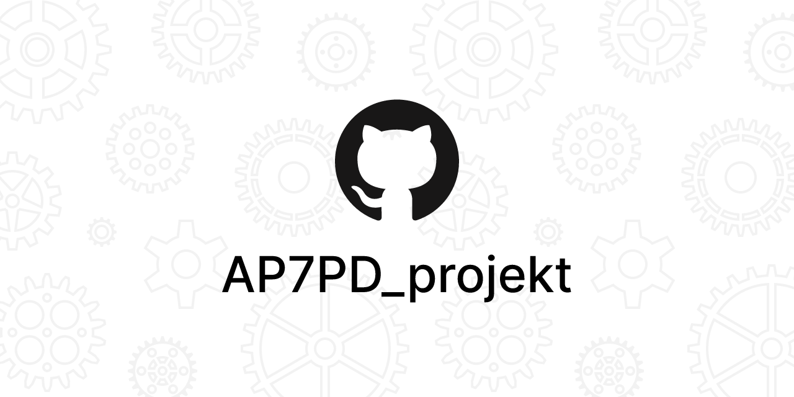

> Aplikace vyžaduje Java JRE & JDK 17

## Nastavení databaze
1) Instalace Mongo DB https://www.mongodb.com/docs/manual/installation/
```
mongosh
```

2) Zvolení databaze
```
use libraryapp
```

3) Vytvoření uživatele pro aplikaci
```
db.createUser(
  {
    user: "LibraryUser",
    pwd:  "WmdOpdSs9YHiGShT3f00",  
    roles: [ { role: "readWrite", db: "libraryapp" } ]
  }
)
```

> Java Spring + MongoDB + Thymeleaf

## ERD diabram
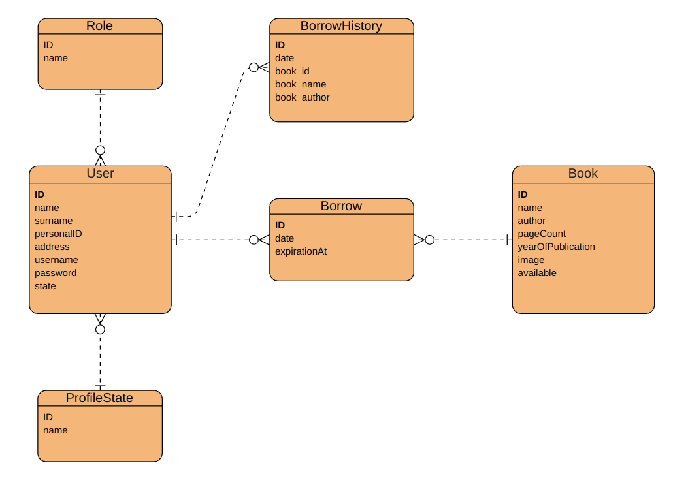

## View hierarchy diagram
[Wireframe navrhy ke vsem view](./dokumentace/view)

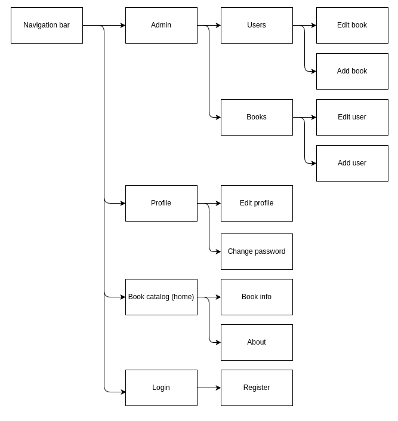

## Views
> Login

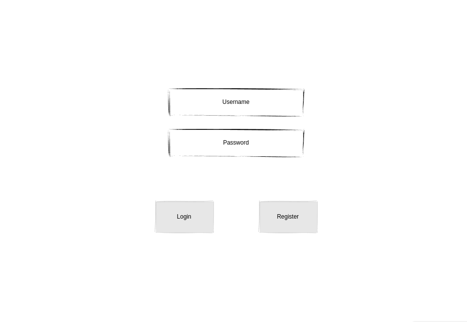

> Register

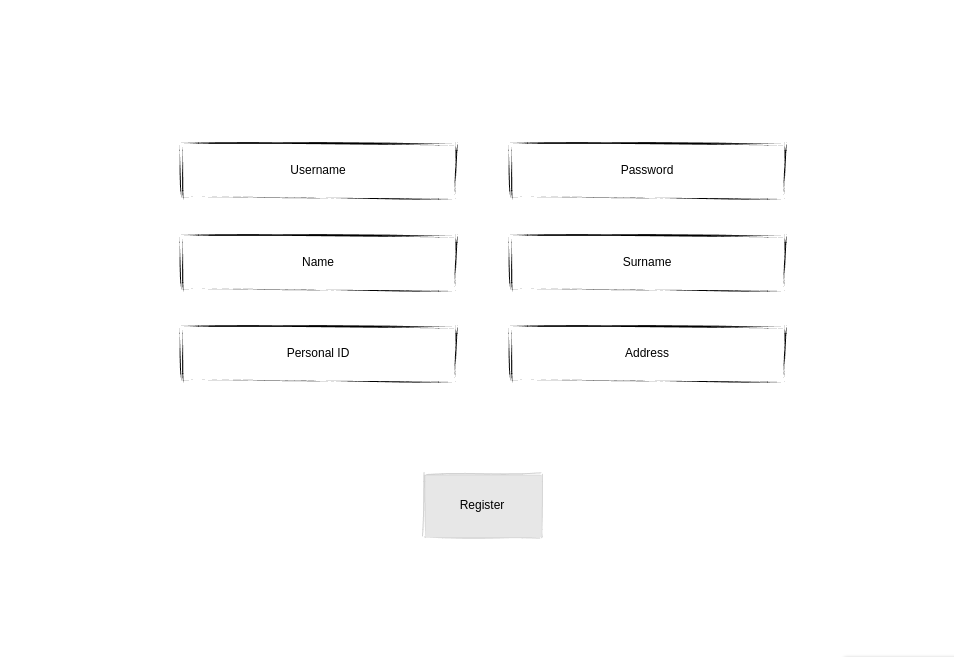

> Navigation bar

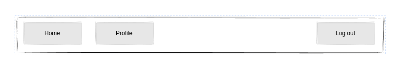

> Book catalog (home)

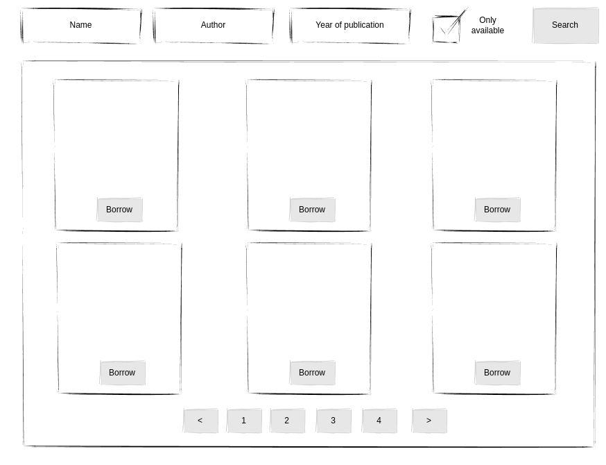

> Profile

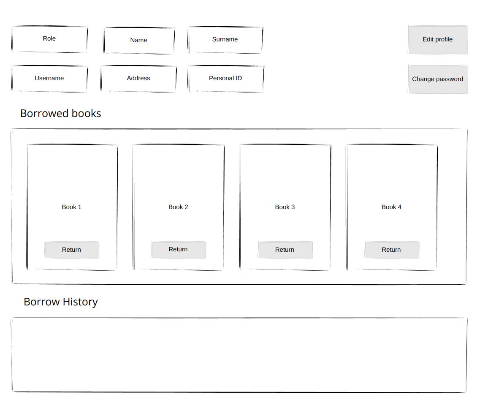

> Chane password

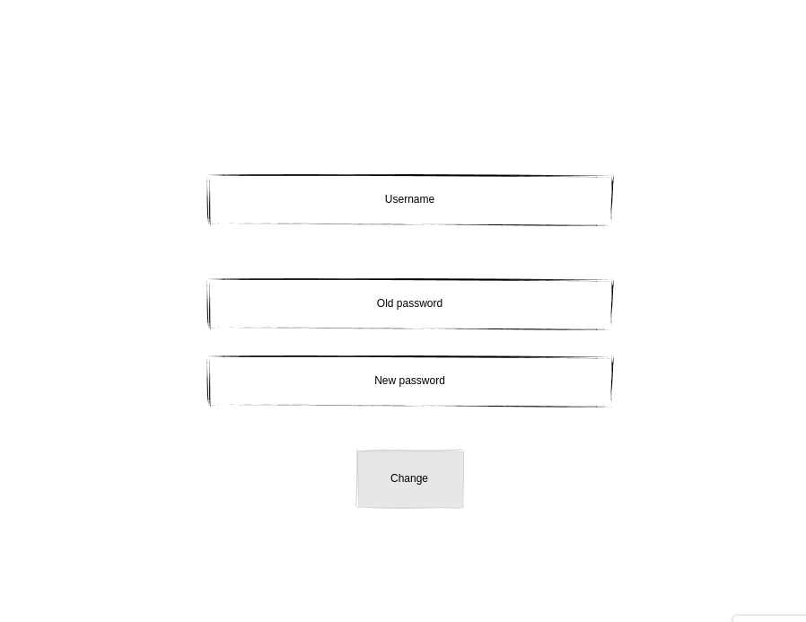

> Edit user/proofile

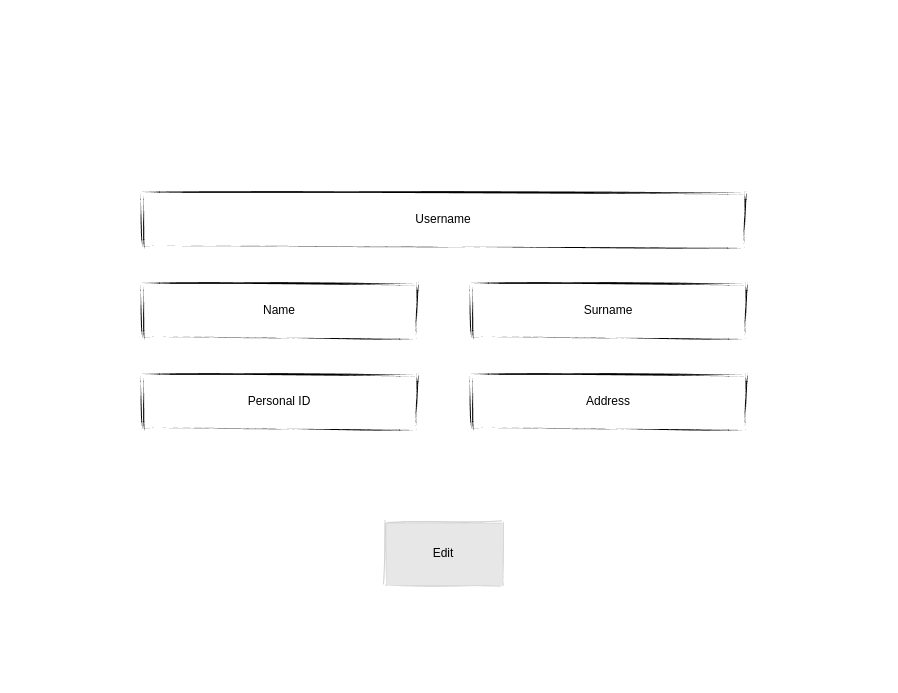

> Admin

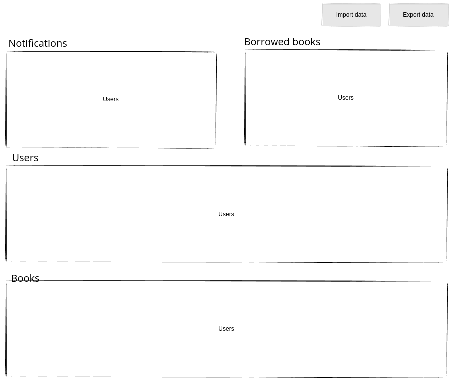

> Create/Edit book

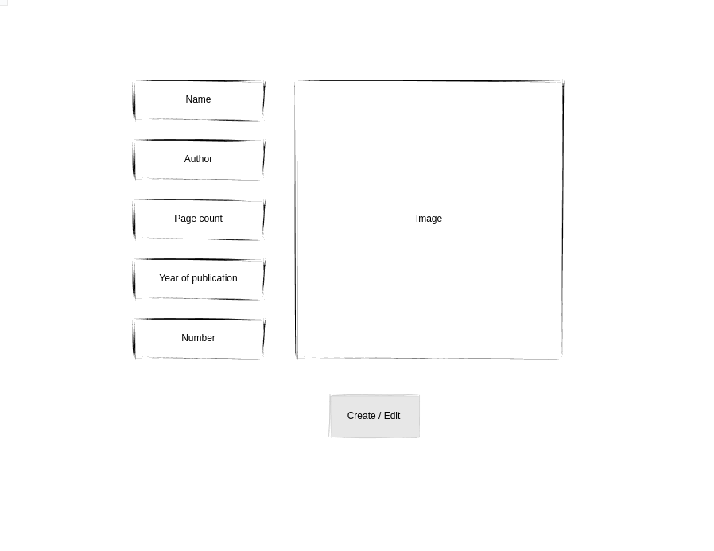
