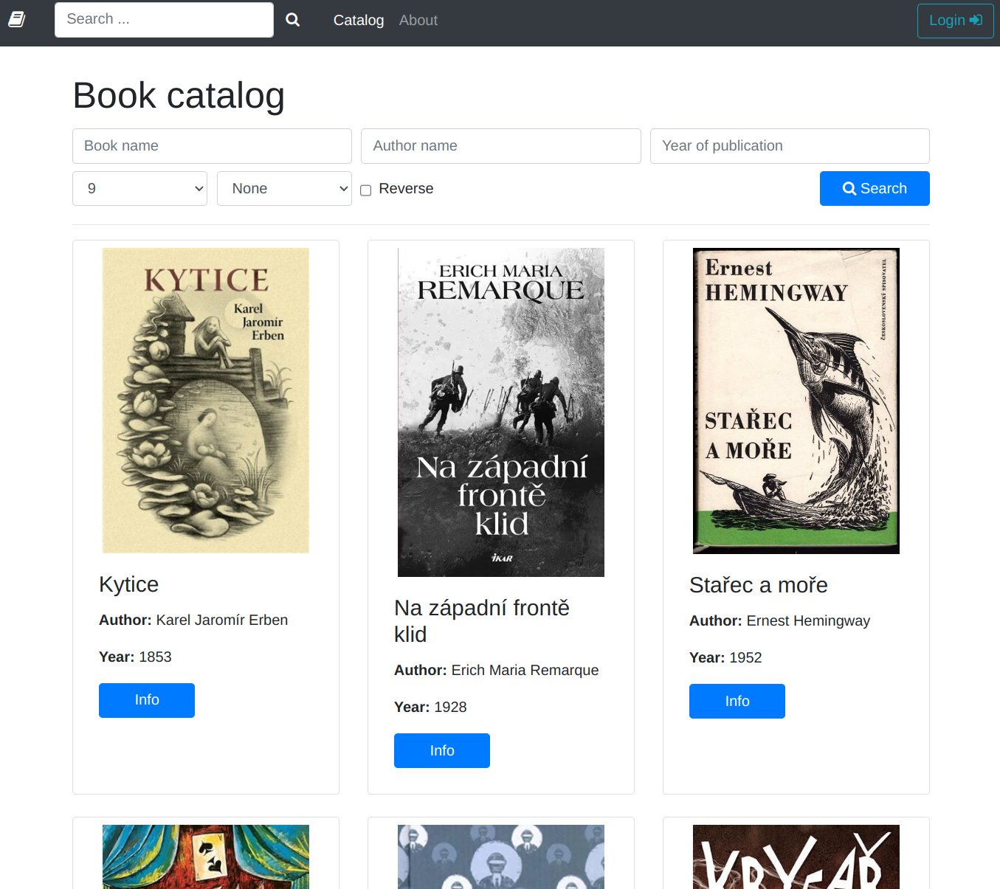
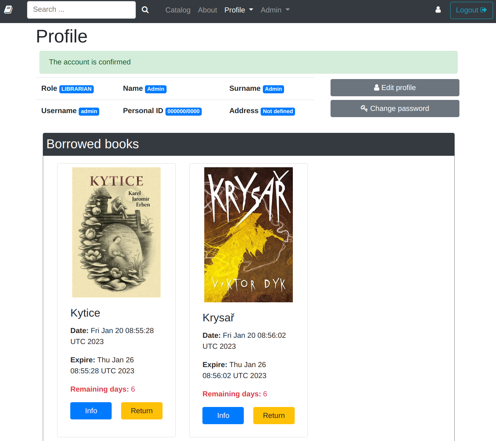
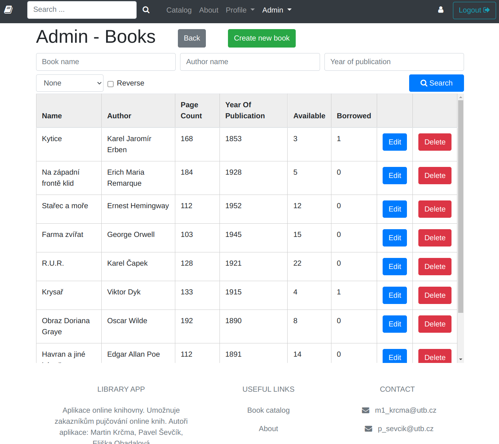

Online library web application (Java Spring + MongoDB + Thymeleaf). Require Java JRE & JDK 17. 

## Database setup
1) Install Mongo DB and Mongo shell: https://www.mongodb.com/docs/manual/installation/
```
mongosh
```

2) Selecte db name
```
use libraryapp
```

3) Create DB user for library app
```
db.createUser(
  {
    user: "LibraryUser",
    pwd:  "WmdOpdSs9YHiGShT3f00",  
    roles: [ { role: "readWrite", db: "libraryapp" } ]
  }
)
```

## Features
* user login/register
* book catalog with filter options
* user profile (profile editing, borrowed books, borrow history)
* full text searching
* export & import of database in admin section
* admin section (user management, book management, all borrowed books, history of all borrows)
* create new book (title, author, text, image of book, ...)

## ERD diabram


## View hierarchy diagram
[Wireframe navrhy ke vsem view](./dokumentace/view)


## App preview
> Book catalog


> Book info


> User profile


> Admin - books


## Authors:
Martin Krčma, Pavel Ševčík, Eliška Obadalová
